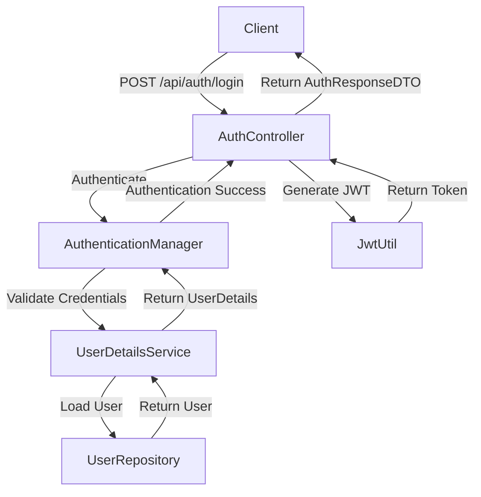
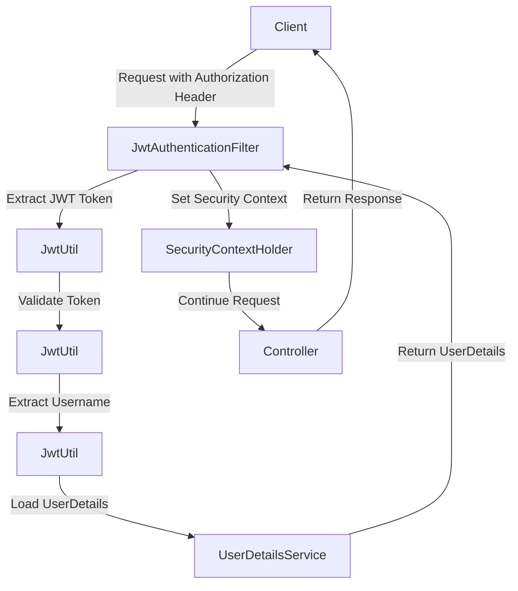

# Spring Boot Security Implementation Guide

## 🔒 Security Overview

This guide documents the security implementation in the Spring Web application, which uses **JWT (JSON Web Tokens)** for stateless authentication and **Spring Security** for authorization.

## 🎯 Security Features

### 1. **JWT Authentication**
- Stateless authentication using JSON Web Tokens
- Secure token generation and validation
- Configurable token expiration
- Bearer token authentication

### 2. **Password Security**
- BCrypt password hashing
- Secure password storage
- Automatic password encoding

### 3. **Role-Based Access Control**
- Admin and User roles
- Fine-grained endpoint authorization
- Role-based access to resources

### 4. **Secure Endpoints**
- CSRF protection (disabled for API, enabled for web forms)
- Stateless sessions
- Secure HTTP headers

## 🔧 Configuration

### JWT Configuration

Add the following to `application.properties`:

```properties
# JWT configuration
app.jwt.secret=yourSecureSecretKeyHere12345678901234567890123456789012
app.jwt.expiration=86400000  # 24 hours in milliseconds
```

**Important:** The JWT secret should be:
- At least 32 characters long
- Random and unpredictable
- Stored securely (consider using environment variables in production)

### Security Endpoints

```properties
# Public endpoints (no authentication required)
/api/auth/**

# Admin-only endpoints
/api/users/**

# All other endpoints require authentication
/**
```

## 🚀 Authentication Flow

### 1. User Login



### 2. Protected Requests



## 📋 API Endpoints

### Authentication Endpoints

#### Login
```http
POST /api/auth/login
Content-Type: application/json

{
    "email": "admin@example.com",
    "password": "admin123"
}
```

**Response:**
```json
{
    "token": "eyJhbGciOiJIUzI1NiIsInR5cCI6IkpXVCJ9..."
}
```
